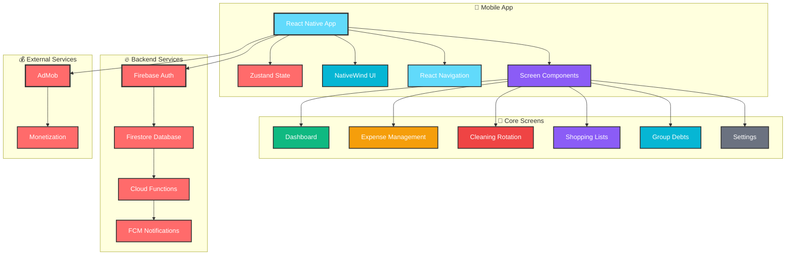

# 🏠 **Roomies**

  

### **Transform Shared Living into Seamless Harmony** ✨

*Built with cutting-edge technology for modern roommates*

> ⚠️ **License**: Not open-source. All rights reserved.  
> No copying, redistribution, or derivative works without permission.

---

## 📋 **Table of Contents**

- [🚀 Downloads](#-downloads)
- [🎯 What is Roomies?](#-what-is-roomies)
- [✨ Features](#-features)
- [🏗️ Architecture](#️-architecture)
- [🛠️ Technology Stack](#️-technology-stack)
- [🔧 Technical Overview](#-technical-overview)
- [🌍 Internationalization](#-internationalization)
- [🔒 Security & Privacy](#-security--privacy)
- [📊 Performance](#-performance)
- [🖼️ Branding & Assets](#️-branding--assets)
- [📄 License](#-license)
- [👥 Team](#-team)
- [🙏 Acknowledgments](#-acknowledgments)

---

## 🚀 **Downloads**

### **Download & Install** 📱

---

## 🎯 **What is Roomies?**

**Roomies** is a revolutionary roommate management app that transforms shared living into a seamless, organized experience. Built with cutting-edge technology and designed for modern roommates who want to live harmoniously while managing their shared responsibilities efficiently.

### 🌟 **Key Highlights**
- **Real-time synchronization** across all devices
- **Intelligent expense tracking** with automatic debt calculations
- **Smart cleaning rotation** with notifications
- **Collaborative shopping lists** with purchase tracking
- **Beautiful, intuitive UI** with dark/light mode support
- **Full Hebrew & English support** with RTL layout

---

## ✨ **Features**

### 🧹 **Smart Cleaning Management**

- **Automatic rotation** of cleaning responsibilities
- **Real-time notifications** for upcoming cleaning tasks
- **Customizable cleaning schedules** and preferences
- **Task completion tracking** with history
- **Smart reminders** to keep everyone on track

### 💰 **Intelligent Expense Tracking**

- **Automatic debt calculations** between roommates
- **Category-based expense organization**
- **Real-time balance updates** across all devices
- **Expense history** and detailed analytics
- **Settlement tracking** and debt management

### 🛒 **Collaborative Shopping**

- **Shared shopping lists** with real-time updates
- **Purchase tracking** with automatic expense integration
- **Priority-based item organization**
- **Quantity and notes management**
- **Smart repurchase suggestions**

### 🏠 **Apartment Management**

- **Easy apartment creation** and joining
- **Secure invite codes** for roommate invitations
- **Member management** with role-based permissions
- **Profile customization** and preferences
- **Data synchronization** across all devices

---

## 🏗️ **Architecture**

### **System Overview**
- **Frontend**: React Native with TypeScript for type safety
- **State Management**: Zustand for efficient global state
- **Backend**: Firebase for real-time data and authentication
- **Core Features**: Expense tracking, cleaning rotation, shopping lists, debt management
- **Real-time**: Firestore for instant data synchronization across all devices
- **Monetization**: AdMob integration for revenue generation

---

## 🛠️ **Technology Stack**

### **Frontend & Mobile**

### **Backend & Database**

### **State Management & Navigation**

### **UI & Styling**

### **Monetization**

### **Analytics & Monitoring**

### **Development & Build**

---

> **Source code is private.** This repository showcases product information, screenshots, and release notes only.

---

## 🔧 **Technical Overview**

### **Architecture Highlights**
- **Modern React Native** with Expo framework
- **Real-time Firebase** backend integration
- **TypeScript** for type safety and better development experience
- **Zustand** for efficient state management
- **NativeWind** for responsive styling

### **Performance Features**
- **Optimized bundle size** with code splitting
- **Smooth animations** with React Native Reanimated
- **Offline-first architecture** with data caching
- **Real-time synchronization** across all devices
- **Efficient memory management** and battery optimization

---

## 🌍 **Internationalization**

Roomies supports multiple languages with full RTL support:

- **English** (Default)
- **Hebrew** (עברית) - Full RTL support
- **Easy to extend** for additional languages

---

## 🔒 **Security & Privacy**

- **End-to-end encryption** for sensitive data
- **Firebase Security Rules** for data protection
- **User authentication** with Firebase Auth
- **Secure API endpoints** with proper validation
- **Privacy-first design** - no unnecessary data collection
- **GDPR compliant** data handling

---

## 📊 **Performance**

- **Real-time synchronization** with Firestore
- **Optimized bundle size** with code splitting
- **Efficient state management** with Zustand
- **Smooth animations** with React Native Reanimated
- **Fast startup time** with optimized loading
- **Offline-first architecture** with data caching

---

## 🖼️ **Branding & Assets**

All Roomies names, logos, icons, screenshots, and related assets are copyright © Yonatan Rotem. All rights reserved. Not licensed for reuse.

### **Intellectual Property**
- **Trademark**: "Roomies" and associated branding
- **Design Assets**: UI/UX designs, icons, and visual elements
- **Screenshots**: Application interface and user experience
- **Documentation**: Technical specifications and user guides
- **Source Code**: All implementation and business logic

### **Usage Rights**
This repository is provided for demonstration and portfolio purposes only. No permission is granted for:
- Copying or redistributing any content
- Creating derivative works
- Commercial use of any assets
- Reverse engineering or decompilation

For licensing inquiries, please contact: yonatan.rotem@example.com

---

## 📄 **License**

This project is **NOT open-source**. All rights reserved.

- **Copyright © 2025 Yonatan Rotem**
- **All Rights Reserved**
- **No copying, redistribution, or derivative works permitted**
- **Source code is private and proprietary**

See the [LICENSE](LICENSE) file for complete terms and conditions.

---

## 👥 **Team**

### **Developed with ❤️ by**

**Yonatan Rotem**

---

## 🙏 **Acknowledgments**

- **Firebase** for providing an amazing backend platform
- **Expo** for simplifying React Native development
- **React Native Community** for excellent libraries and tools
- **All contributors** who helped make this project possible

---

### **⭐ Star this repository if you found it helpful!**

---

**Made with ❤️ and lots of hot chocolate ☕**

